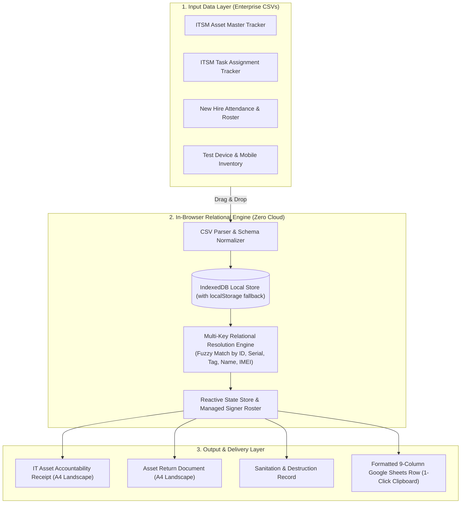
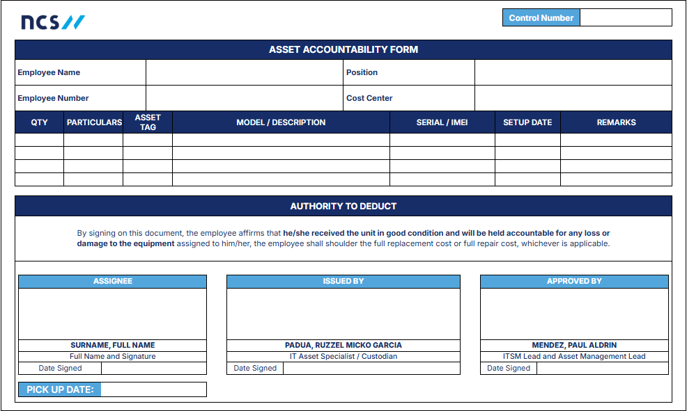
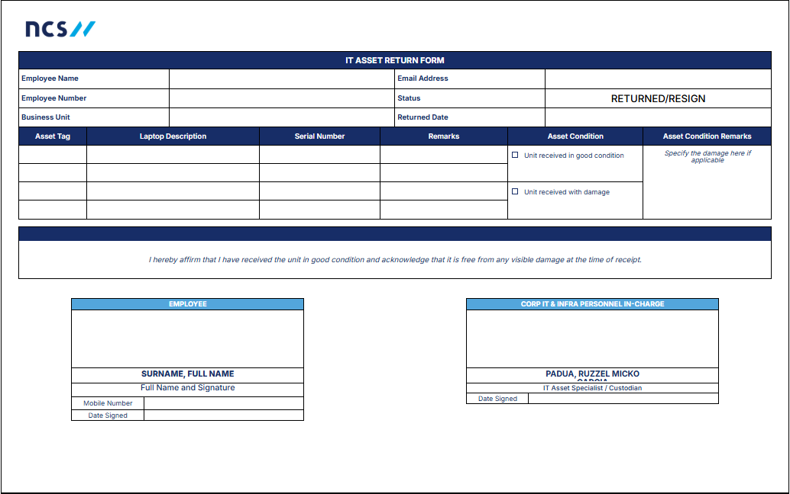

# NCS ITSM Multi-Source Form Automation & Asset Reconciliation Engine

[](https://mishaeloliva.github.io/NCS-Automation/)
[](https://github.com/MishaelOliva/NCS-Automation/actions/workflows/ci.yml)
[](https://developer.mozilla.org/en-US/docs/Web/JavaScript)
[]()
[-4285F4.svg?style=flat)]()
[]()
[](LICENSE)

A client-side enterprise automation utility engineered to eliminate manual data entry across multi-source IT Service Management (ITSM) asset operations. Built and deployed during a **720-hour IT Asset & Infrastructure Support practicum at NCS Group**.

> 🌐 **Live Web Application:** [https://mishaeloliva.github.io/NCS-Automation/](https://mishaeloliva.github.io/NCS-Automation/)

Developed by **Mishael Dioneda Oliva** ([GitHub](https://github.com/MishaelOliva) | [LinkedIn](https://linkedin.com/in/mishael-oliva)).

---

## Executive Summary & Business Impact

During enterprise device handovers (onboarding, equipment refresh, replacement, and resignations), IT support engineers must issue and archive three signed legal accountability documents:
1. **IT Asset Accountability Form** (Laptop & peripheral handover receipt for new hires and hardware refreshes)
2. **IT Asset Return Form** (Custody transfer document for resigned staff or hardware replacement)
3. **Sanitation & Data Destruction Form** (Formal record of HDD wiping, BitLocker removal, and physical sanitization)

### The Problem (Manual Spreadsheet Cross-Referencing)
Prior to this utility, preparing a single signed document required opening and manually cross-referencing **4 disparate CSV/Excel spreadsheets**:
* `ITSM Asset Master Tracker` (Model specifications, serial numbers, warranty, and hostnames)
* `ITSM Task Assignment` (ServiceNow/ITSM ticket numbers, assigned technician, and return reason)
* `New Hire Attendance` (Employee name, employee ID, department, and start date)
* `Test Device Tracker` (IMEI numbers, mobile test hardware, and peripheral tags)

Engineers had to manually copy-paste serial numbers, MAC addresses, and employee details into printable templates—taking **15 to 20 minutes per device**. During mass onboarding events (deploying 50+ laptops in a single morning), this caused severe operational delays, transcription typos in 12-character serial numbers, and audit discrepancies.

### The Solution & Measured Impact
This application provides an in-browser, privacy-first relational lookup engine that caches the 4 CSV datasets and automatically joins and populates complete, print-ready A4 handover forms from a single search query.

* **95%+ Time Reduction:** Cuts preparation time from **15+ minutes to under 3 seconds** per form.
* **100% Data Accuracy:** Completely eliminates manual transcription errors across serial numbers and asset tags.
* **Zero Infrastructure Overhead:** Pure client-side application requiring no backend servers, database setup, or IT cloud approvals.
* **Enterprise Security & Privacy by Design:** 100% of employee Personally Identifiable Information (PII) and corporate hardware serials remain isolated inside the local browser sandbox; **zero data ever leaves the machine**.

---

## System Architecture



---

## Visual Showcase

### Form Layouts & Print Outputs

| IT Asset Accountability Receipt | Asset Return & Sanitation Form |
| :---: | :---: |
|  |  |
| *Auto-populates employee details, device specs, serial numbers, and IT staff signatures.* | *Supports multi-asset returns, return condition dropdowns, and disposal remarks.* |

---

## Key Technical Highlights

### 1. Zero-Cloud Security & Privacy Architecture
Corporate IT policy strictly prohibits uploading confidential asset databases or employee rosters to unauthorized third-party cloud servers or web services. 
* This utility was engineered with **zero external backend dependencies**.
* Data is parsed and cached using browser-native **IndexedDB** (with graceful `localStorage` fallback).
* All lookups and joins execute locally in memory. The system works completely air-gapped without an active internet connection.

### 2. Multi-Key Relational Lookup & Precedence Engine
The resolution engine supports multi-attribute fuzzy lookup across any identifier:
* **Employee Search:** Employee ID or Full Name (automatically resolves both First-Last and Last-First naming formats).
* **Asset Search:** Serial Number, Asset Tag, Hostname, or IMEI.
* **Legacy Identifier Normalization:** Automatically detects and resolves legacy company asset prefixes (e.g., Yondu `YON-` vs standard `LAP-`), ensuring consistent matching across older inventory logs.

### 3. Pixel-Perfect CSS Print Engine
Standard web pages break unpredictably when printed. This utility implements an advanced `@media print` contract:
* **Strict A4 Landscape & Portrait Fitting:** Dynamically scales content, margins, and line heights to ensure tables and signature blocks fit exactly within standard page boundaries.
* **Dynamic Continuation Pages:** Intelligently splits high-wrap multi-asset forms into balanced continuation pages without orphan headers or split signature blocks.
* **Auto-Growing Description Mirrors:** Prevents text truncation on unusually long device models or hardware descriptions.

### 4. Managed Signer Roster
IT operations involve designated inventory engineers, supervisors, and department leads. The app maintains a persistent roster of authorized signers in local storage, allowing one-click selection of signatories on all generated forms.

### 5. Google Sheets 1-Click Bridge
To keep central Google Sheets trackers up to date, the application includes a `Copy Row` utility that extracts the generated return payload, formats it as a sanitized 9-column tab-separated row, and writes it directly to the system clipboard for immediate pasting (`Ctrl + V`) into master spreadsheets.

---

## Quickstart & Live Demo (1-Minute Test Drive)

No build step, Node server, or database installation is required to use or inspect the tool.

### Method 1: Instant Local Run
1. Clone this repository:
   ```bash
   git clone https://github.com/MishaelOliva/NCS-Automation.git
   cd NCS-Automation
   ```
2. Open `index.html` directly in any modern browser (Google Chrome, Microsoft Edge, Brave, Firefox):
   ```powershell
   Start-Process index.html
   ```

### Method 2: Test Drive with Sample Data
Pre-packaged, sanitized CSV test datasets are provided in [`tests/fixtures/`](tests/fixtures/):
1. In the left sidebar under **Data sources**, click or drag-and-drop the 4 sample files from `tests/fixtures/`:
   * `master-tracker.csv`
   * `itsm-task-assignment.csv`
   * `new-hire-attendance.csv`
   * `test-device.csv`
2. In the lookup field, enter a sample Asset Tag (e.g., `lap-001` or `lap-002`) or Employee ID (`1001`).
3. Observe all form fields (Employee Name, Department, Asset Tag, Serial, Model, Specs, Signer) populate automatically in milliseconds.
4. Press `Ctrl + P` to review the print preview formatting.

---

## Automated Test Suite

The repository includes a comprehensive regression test suite with **73 automated test cases** verifying schema mapping, IndexedDB caching, edge cases, and print layout calculations.

To run the test suite:
```bash
# Ensure Node.js (v18+) is installed
npm test
```

### Test Coverage Breakdown
```text
✔ detects source kinds from file names and canonical names
✔ warns when a successful autofill still has missing core CSV details
✔ replaces uploaded sources by detected role instead of filename only
✔ validates empty files, low-row files, and role/header mismatches
✔ builds print filenames from current form fields
✔ seeds, adds, resolves, and deletes shared signer roster names
✔ builds nine-column Google Sheets rows for returned assets
✔ strips legacy Yondu prefixes from asset-tag autofill
✔ resolves new-hire and replacement accountability payloads
✔ plans compact accountability pages without losing or reordering assets
✔ fits long printable signature positions without increasing row height
...
ℹ tests 73 | pass 73 | fail 0 | duration_ms ~500ms
```

---

## Technical Interview Talking Points

If asked about this project in a software engineering or AI developer interview:

1. **Why build a browser-based SPA instead of a Python script or CLI?**
   *"In corporate enterprise IT, support staff are not developers and lack Python environments or terminal access on locked-down Windows endpoints. A self-contained browser app required zero installation, worked instantly on any employee laptop, and had zero barriers to adoption."*

2. **Why use IndexedDB instead of a central SQL database?**
   *"Enterprise data governance. Internal inventory sheets contain confidential hardware serials and employee employee IDs. Moving that data to an external backend would require IT Infosec compliance approval. By keeping everything in client-side IndexedDB, data never traverses a network, eliminating security risks while providing instant sub-millisecond lookups."*

3. **How did you handle schema inconsistencies across different departments?**
   *"The four CSV sources had mismatched column headers and casing (e.g., 'Emp_ID' vs 'Employee ID' vs 'ID'). I implemented a canonical header normalization mapper that identifies source roles based on key columns, normalizes composite headers, and applies fallback precedence rules to guarantee deterministic data resolution."*
