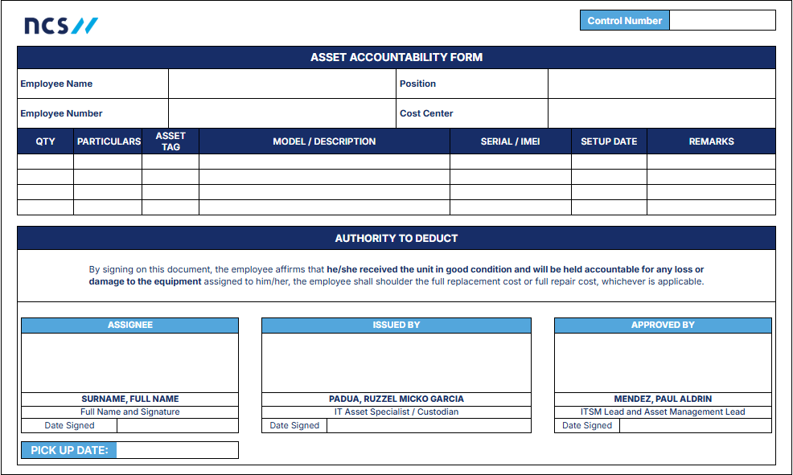
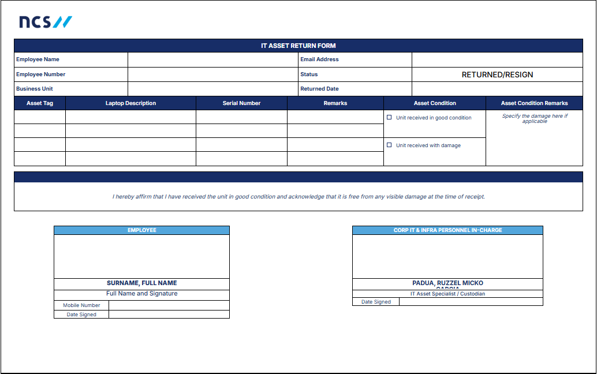

# NCS-Automation

In-browser IT asset reconciliation and handover form generator with client-side CSV parsing, IndexedDB caching, and printable A4 layouts.

[](https://mishaeloliva.github.io/NCS-Automation/)
[](https://github.com/MishaelOliva/NCS-Automation/actions/workflows/ci.yml)
[](https://github.com/MishaelOliva/NCS-Automation/actions)
[](LICENSE)

## What it does

- **Multi-source CSV ingestion**: Loads four spreadsheet exports (Asset Master Tracker, ITSM Task Assignments, New Hire Attendance, and Test Device tracker) directly in the browser without network upload.
- **Relational cross-referencing**: Resolves records across employee IDs, names, asset tags, serial numbers, hostnames, and IMEIs using local indexing and alias normalization.
- **Handover form generation**: Populates A4-formatted accountability receipts, return documents, and sanitization destruction records from a single search query.
- **Clipboard bridge**: Formats returned hardware details into 9-column tab-separated rows for pasting directly into tracking spreadsheets.

## Architecture / How it works

The application is written in vanilla JavaScript (ES6+), HTML5, and CSS3. It runs entirely inside the client browser sandbox without an external backend, database server, or cloud dependency.

```
+-----------------------------------------------------------+
|               Input CSV Sources (Drag & Drop)             |
|   Master Tracker | Task Assignments | Attendance | Devices|
+-----------------------------+-----------------------------+
                              |
                              v
+-----------------------------------------------------------+
|                  In-Browser Client Engine                 |
|                                                           |
|   1. Papaparse Normalizer (Header & Alias Mapping)        |
|   2. Local IndexedDB Cache (with localStorage fallback)   |
|   3. Multi-Key Resolution Index (Serial, Tag, ID, Name)   |
|   4. Reactive Form State & Persistent Signer Roster       |
+-----------------------------+-----------------------------+
                              |
                              v
+-----------------------------------------------------------+
|                      Outputs & Export                     |
|                                                           |
|   - IT Asset Accountability Form (A4 Landscape Print)     |
|   - IT Asset Return Form (A4 Landscape Print)             |
|   - Device Sanitization Record (A4 Landscape Print)       |
|   - Formatted TSV Row for Master Google Sheets Trackers   |
+-----------------------------------------------------------+
```

Because asset serials and employee rosters contain sensitive internal data, all parsing and joins execute strictly in local memory and browser storage.

## Screenshots

| IT Asset Accountability Form | Asset Return & Sanitation Form |
| :---: | :---: |
|  |  |
## Data provenance

**No real data is in this repository.**

This tool was built during a 720-hour practicum, against genuine operational
spreadsheets. Those files were never committed. Everything a reviewer sees here
is generated by [`scripts/generate-demo-data.js`](scripts/generate-demo-data.js),
which invents every value from a fixed seed and has no network access.

| Field | Convention |
| :--- | :--- |
| Employee names | Reserved example names (`Doe`, `Smith`, `Sample`) |
| Emails | `*@example.com` (RFC 2606) |
| Phones | `+63 900 000 xxxx` placeholder block |
| MAC addresses | `02:00:00:xx:xx:xx` — locally administered, never assigned |
| IMEI | `350000xx` — a TAC block not allocated to any manufacturer |
| Serials / tags / IDs | `SYN-…`, `LT-…`, `EMP-…` non-production ranges |
| Vendors, models, costs | `Example Vendor Co.`, `ExampleBook`, seeded random |

See [`assets/demo-data/README.md`](assets/demo-data/README.md) for the full
convention table and regeneration instructions. A regression test in
`tests/app.test.js` fails the build if any employer name, personal email domain,
or real-format identifier reappears in the demo data.

Employer branding was also removed: the app ships a single neutral
`assets/img/brand-mark.png` and contains no third-party logo files. The project
name is retained because it documents the real origin of the work.

## Quick start

No Node server, build pipeline, or database setup is required to run the web
application.

```bash
git clone https://github.com/MishaelOliva/NCS-Automation.git
cd NCS-Automation
```

Open `index.html` directly in any modern browser:

- On Windows: `Start-Process index.html`
- On macOS: `open index.html`
- On Linux: `xdg-open index.html`

You can also use the hosted version on GitHub Pages: [https://mishaeloliva.github.io/NCS-Automation/](https://mishaeloliva.github.io/NCS-Automation/)

## Usage with demo data

Synthetic datasets matching the real schemas are committed in
[`assets/demo-data/`](assets/demo-data/) and are also bundled as minimal test
fixtures in `tests/fixtures/`.

1. Start any static server from the repository root so the app is served over
   HTTP (the demo loader uses `fetch`, which browsers block on `file://`):

   ```bash
   npx serve .
   ```

2. Open the printed local URL, then in the sidebar under **Data sources** press
   **Load demo data**. The four files are fetched and ingested automatically.
3. Alternatively, drag and drop the CSVs from `assets/demo-data/` onto the
   source panel.
4. Search for an asset tag such as `LT-100000` or an employee ID such as
   `EMP-0001`.
5. The employee details, specifications, serial numbers, and signers populate
   into the active form preview.
6. Press `Ctrl + P` to view the single-page A4 print layout.

## Testing

The test suite runs using Node.js built-in test runner (`node --test`) and validates parsing, schema normalization, IndexedDB caching, edge cases, print page split calculations, and demo-data safety:

```bash
npm test
```

79 tests run in approximately 3s with zero external test framework dependencies.

## Known limitations

- **Local browser storage**: Data and configured signer rosters reside in IndexedDB and `localStorage`. Clearing site data in browser settings resets cached records.
- **Schema conventions**: The parser handles standard column header variations, but completely novel spreadsheet column names require manual entry or mapping.
- **Viewport optimization**: The user interface and print styles are tuned for desktop displays and print dialogs; small mobile screens are not actively supported.

## License

This project is licensed under the [MIT License](LICENSE).

---
*Built by [Mishael Oliva](https://github.com/MishaelOliva) • [LinkedIn](https://linkedin.com/in/mishael-oliva)*
